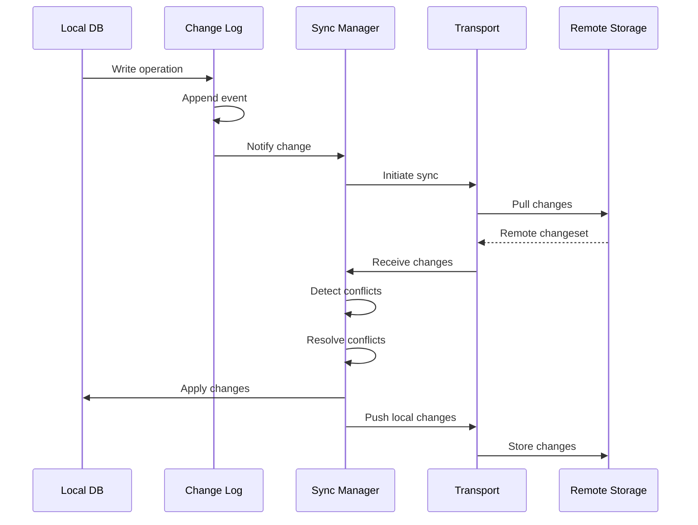

# LoreHub Sync Engine Architecture

> A comprehensive design for distributed knowledge synchronization

## Overview

The LoreHub Sync Engine enables teams to share and synchronize their collective codebase wisdom across devices, team members, and projects while maintaining the local-first philosophy that makes LoreHub fast and reliable.

## Core Design Principles

1. **Local-First**: Full functionality without network connectivity
2. **Eventually Consistent**: Converge to the same state given enough time
3. **Privacy-Preserving**: Selective sync with encryption options
4. **Conflict-Aware**: Intelligent resolution with manual override capability
5. **Performance-Optimized**: Minimal bandwidth and storage overhead

## Architecture Components

### 1. Change Tracking Layer

```typescript
interface ChangeEvent {
  id: string;              // UUID
  entityId: string;        // Lore/Realm/Relation ID
  entityType: 'lore' | 'realm' | 'relation';
  operation: 'create' | 'update' | 'delete' | 'archive';
  timestamp: Date;
  vectorClock: VectorClock;
  userId: string;
  deviceId: string;
  changes: Record<string, any>;  // Field-level changes
  checksum: string;        // For integrity verification
}

class ChangeLog {
  // Append-only log of all local changes
  private changes: ChangeEvent[] = [];
  
  // Merkle tree for efficient diff detection
  private merkleTree: MerkleTree;
  
  // Track last sync position per remote
  private syncPositions: Map<RemoteId, Position>;
}
```

### 2. Sync State Manager

```typescript
interface SyncState {
  localVersion: string;           // Local database version
  remotes: Map<RemoteId, RemoteState>;
  syncQueue: SyncOperation[];
  conflicts: ConflictRecord[];
  lastSyncAttempt: Date;
  nextSyncScheduled: Date;
}

interface RemoteState {
  id: string;
  endpoint: string;
  lastSyncSuccess: Date;
  lastKnownVersion: string;
  vectorClock: VectorClock;
  status: 'connected' | 'disconnected' | 'error';
  pendingChanges: number;
}
```

### 3. Conflict Resolution Engine

```typescript
interface ConflictResolver {
  // Resolution strategies
  strategies: {
    lastWriteWins: (local: Lore, remote: Lore) => Lore;
    threeWayMerge: (base: Lore, local: Lore, remote: Lore) => Lore;
    manualResolution: (conflict: Conflict) => Promise<Lore>;
    fieldLevel: (conflicts: FieldConflict[]) => Record<string, any>;
  };
  
  // Resolution rules by entity type
  rules: {
    lore: {
      content: 'threeWayMerge',
      confidence: 'lastWriteWins',
      relations: 'union',
      provinces: 'union',
      sigils: 'union'
    };
  };
}
```

### 4. Transport Layer

```typescript
interface SyncTransport {
  // Core sync operations
  pull(remote: RemoteId, since: Position): Promise<ChangeSet>;
  push(remote: RemoteId, changes: ChangeSet): Promise<SyncResult>;
  
  // Optimization features
  negotiateProtocol(remote: RemoteId): Promise<Protocol>;
  compress(data: ChangeSet): CompressedData;
  encrypt(data: any, publicKey: string): EncryptedData;
  
  // Connection management
  connect(endpoint: string, credentials: Credentials): Promise<Connection>;
  disconnect(remote: RemoteId): Promise<void>;
  
  // Real-time features
  subscribe(remote: RemoteId, callback: ChangeCallback): Subscription;
}
```

### 5. Storage Adapters

```typescript
interface StorageAdapter {
  // Different backend implementations
  git: GitStorageAdapter;        // Uses git as sync backend
  cloud: CloudStorageAdapter;     // S3/GCS with metadata
  p2p: P2PStorageAdapter;        // Direct device-to-device
  server: ServerStorageAdapter;   // Central PostgreSQL/MySQL
}

// Example: Git-based sync
class GitStorageAdapter implements StorageAdapter {
  async push(changes: ChangeSet): Promise<void> {
    // Store changes as git objects
    // Use git's natural conflict resolution
    // Leverage existing git infrastructure
  }
  
  async pull(since: Commit): Promise<ChangeSet> {
    // Read git history since commit
    // Parse changes from commits
    // Build changeset
  }
}
```

## Data Flow

### Sync Process



## Implementation Phases

### Phase 1: Foundation (2-3 weeks)
- [ ] Implement change tracking table and triggers
- [ ] Create ChangeLog service with event capture
- [ ] Add vector clock implementation
- [ ] Build basic sync state management

### Phase 2: Git-based Sync (3-4 weeks)
- [ ] Implement GitStorageAdapter
- [ ] Add sync command to CLI
- [ ] Create conflict detection logic
- [ ] Build simple last-write-wins resolution

### Phase 3: Conflict Resolution (2-3 weeks)
- [ ] Implement three-way merge for content
- [ ] Add field-level conflict resolution
- [ ] Create CLI conflict resolution UI
- [ ] Add manual override capability

### Phase 4: Cloud Sync (3-4 weeks)
- [ ] Build CloudStorageAdapter (S3/GCS)
- [ ] Add authentication/authorization
- [ ] Implement encryption layer
- [ ] Create web dashboard for sync status

### Phase 5: Advanced Features (4-5 weeks)
- [ ] P2P sync implementation
- [ ] Real-time sync with WebSockets
- [ ] Selective sync by realm/province
- [ ] Sync performance optimizations

## Security Considerations

### Encryption
- End-to-end encryption option for sensitive lores
- Per-realm encryption keys
- Key rotation support

### Access Control
- Fine-grained permissions (read/write/admin)
- Realm-level access control
- Province-based filtering

### Audit Trail
- Complete sync history
- Who changed what and when
- Rollback capabilities

## Performance Optimizations

### Delta Sync
- Only transfer changed fields
- Binary diff for large content
- Compression before transfer

### Batch Operations
- Group multiple changes
- Reduce network round trips
- Transaction-like semantics

### Smart Scheduling
- Adaptive sync frequency
- Network-aware scheduling
- Battery-conscious on mobile

## Conflict Resolution Strategies

### Last Write Wins (LWW)
- Simple, deterministic
- Good for metadata fields
- Uses vector clocks for ordering

### Three-Way Merge
- For content fields
- Preserves both changes when possible
- Falls back to manual resolution

### Union Strategy
- For arrays (provinces, sigils)
- Combines values from both sides
- Removes duplicates

### Manual Resolution
- Complex conflicts
- User preference
- Maintains conflict history

## Future Enhancements

### 1. AI-Powered Sync
- Intelligent conflict resolution
- Predictive sync scheduling
- Anomaly detection in sync patterns

### 2. Federation Support
- Cross-organization sync
- Public lore repositories
- Lore marketplace

### 3. Advanced Analytics
- Sync performance metrics
- Collaboration patterns
- Knowledge flow visualization

### 4. Mobile Support
- React Native client
- Offline-first mobile app
- Push notifications

## Configuration

```json
{
  "sync": {
    "enabled": true,
    "mode": "manual" | "automatic",
    "interval": 300000,  // 5 minutes
    "backends": [
      {
        "type": "git",
        "remote": "origin",
        "branch": "lorehub-sync"
      },
      {
        "type": "cloud",
        "provider": "s3",
        "bucket": "team-lorehub",
        "region": "us-east-1"
      }
    ],
    "encryption": {
      "enabled": true,
      "algorithm": "aes-256-gcm"
    },
    "conflicts": {
      "autoResolve": true,
      "strategy": "lastWriteWins",
      "requireConfirmation": true
    }
  }
}
```

## Error Handling

### Network Failures
- Exponential backoff with jitter
- Offline queue persistence
- Automatic retry on reconnection

### Data Corruption
- Checksum verification
- Automatic rollback
- Manual recovery tools

### Version Conflicts
- Protocol negotiation
- Backward compatibility
- Migration helpers

## Testing Strategy

### Unit Tests
- Change tracking accuracy
- Conflict resolution logic
- Merkle tree operations

### Integration Tests
- End-to-end sync flows
- Multi-device scenarios
- Network failure simulation

### Performance Tests
- Large dataset sync
- High-frequency changes
- Bandwidth optimization

## Monitoring & Observability

### Metrics
- Sync success/failure rates
- Conflict frequency
- Sync duration
- Data transfer volumes

### Logging
- Detailed sync operations
- Conflict resolution decisions
- Error conditions

### Alerts
- Sync failures
- High conflict rates
- Performance degradation

---

This architecture provides a solid foundation for implementing distributed synchronization in LoreHub while maintaining its core values of simplicity, performance, and local-first operation.